# ComfyUI-Kaola-ACE-Step

ComfyUI custom nodes for [ACE-Step 1.5](https://github.com/ace-step/ACE-Step-1.5) - Commercial-grade music generation.

## Features

- 🎵 **Text to Music** - Generate music from text
- 🎭 **Cover Generation** - Style transfer
- 🎨 **Audio Repaint** - Local audio editing
- 💡 **Simple Mode** - Natural language to music
- 📝 **Format Sample** - Enhance user input
- 🔍 **Understand Audio** - Analyze audio codes
- 🎤 **Audio Transcription** - Transcribe lyrics from audio
- 📋 **Audio Captioning** - Generate detailed music descriptions
- 🎸 **Extract/Lego/Complete** - Track extraction and manipulation (Base model)
- 🧹 **Clear VRAM** - Free GPU memory after operations

## Quick Start

### 1. Install ACE-Step

```bash
git clone https://github.com/ACE-Step/ACE-Step-1.5.git
cd ACE-Step-1.5
pip install -e .
```

### 2. Install ComfyUI Nodes

**Standard Installation:**
```bash
cd ComfyUI/custom_nodes
git clone https://github.com/kana112233/ComfyUI-kaola-ace-step.git
cd ComfyUI-kaola-ace-step
pip install -r requirements.txt
```

**For ComfyUI Portable:**
```bash
# Navigate to your ComfyUI portable folder
cd ComfyUI_windows_portable/ComfyUI/custom_nodes
git clone https://github.com/kana112233/ComfyUI-kaola-ace-step.git

# Use the embedded Python to install requirements
cd ComfyUI-kaola-ace-step
../../python_embeded/python.exe -m pip install -r requirements.txt

# You must also install ACE-Step in the embedded Python:
cd ../../../
git clone https://github.com/ACE-Step/ACE-Step-1.5.git
python_embeded/python.exe -m pip install -e ACE-Step-1.5
```

### 3. Download Models

```bash
# Using huggingface-cli
huggingface-cli download ACE-Step/Ace-Step1.5 --local-dir ComfyUI/models/Ace-Step1.5

# Or using hfd (faster)
pip install hfd
hfd ACE-Step/Ace-Step1.5 --local-dir ComfyUI/models/Ace-Step1.5
```

### 4. Restart ComfyUI

## Node Settings

| Parameter | Value |
|----------|-------|
| `checkpoint_dir` | Leave empty (uses `ComfyUI/models/Ace-Step1.5/`) |
| `config_path` | `acestep-v15-turbo` (fast) or `acestep-v15-base` (quality) |
| `lm_model_path` | `acestep-5Hz-lm-1.7B` (recommended) |
| `device` | `auto` (auto-detects MPS/CUDA/CPU) |

## Model Directory Structure

Ensure your models are organized like this:

```
ComfyUI/models/Ace-Step1.5/
├── acestep-v15-turbo/      # DiT model (turbo version)
├── acestep-v15-base/       # DiT model (base version, optional)
├── acestep-5Hz-lm-1.7B/    # LM model
├── vae/                    # VAE model
└── Qwen3-Embedding-0.6B/   # Embedding model
```

## Workflow Examples

See [examples/](examples/) directory for ready-to-use workflows.

## Nodes

| Node | Description |
|------|-------------|
| **ACE_STEP_TextToMusic** | Generate music from text |
| **ACE_STEP_Cover** | Style transfer |
| **ACE_STEP_Repaint** | Local audio editing |
| **ACE_STEP_SimpleMode** | Natural language generation |
| **ACE_STEP_FormatSample** | Format and enhance input |
| **ACE_STEP_Understand** | Analyze audio codes |
| **ACE_STEP_Transcriber** | Transcribe lyrics from audio (50+ languages) |
| **ACE_STEP_Captioner** | Generate detailed music descriptions |
| **ACE_STEP_Extract** | Extract instrument/vocal tracks (Base model) |
| **ACE_STEP_Lego** | Add/modify instrument tracks (Base model) |
| **ACE_STEP_Complete** | Complete missing tracks (Base model) |
| **ACE_STEP_ClearVRAM** | Free GPU memory |

📖 **Detailed usage guide**: See [USAGE.md](USAGE.md) for comprehensive documentation.

## ACE_STEP_TRANSCRIBER

Audio transcription node powered by [ACE-Step Transcriber](https://huggingface.co/ACE-Step/acestep-transcriber) (Qwen2.5-Omni-7B).

### Features
- 🌍 **50+ Languages** - Chinese, English, Japanese, Korean, etc.
- 🎵 **Lyrics Transcription** - Specialized for singing voice
- 🏷️ **Structure Tags** - Auto identifies [Verse], [Chorus], [Bridge], etc.
- ⏱️ **Timestamps** - Via prompt instruction
- ✂️ **Chunked Processing** - Handle long audio automatically

### Installation

Download the model to your models folder:
```bash
# Using huggingface-cli
huggingface-cli download ACE-Step/acestep-transcriber --local-dir ComfyUI/models/acestep-transcriber

# Or place inside Ace-Step1.5 folder
huggingface-cli download ACE-Step/acestep-transcriber --local-dir ComfyUI/models/Ace-Step1.5/acestep-transcriber
```

### Parameters

| Parameter | Default | Description |
|-----------|---------|-------------|
| `language` | auto | Target language (auto/zh/en/ja/ko/etc.) |
| `chunk_length_s` | 30 | Audio chunk length in seconds |
| `max_new_tokens` | 4096 | Max output length |
| `temperature` | 0.2 | Sampling temperature |
| `top_p` | 0.95 | Nucleus sampling threshold |
| `repetition_penalty` | 1.1 | Penalty for repeating tokens |
| `num_beams` | 1 | Beam search (higher = slower but better) |
| `seed` | 0 | Random seed (0 = random) |
| `custom_prompt` | "" | Override default prompt |

## ACE_STEP_Captioner

Audio captioning node powered by [ACE-Step Captioner](https://huggingface.co/ACE-Step/acestep-captioner) (Qwen2.5-Omni-7B).

### Features
- 🎼 **Musical Style Analysis** - Identifies genres, sub-genres, and stylistic influences
- 🎸 **Instrument Recognition** - Detects and describes 1000+ instrument types
- 🎭 **Structure & Progression** - Analyzes musical arrangement (intro, verse, chorus, bridge, etc.)
- 🔊 **Timbre Description** - Captures tonal qualities, textures, and sonic characteristics

### Performance
Accuracy surpasses Gemini Pro 2.5 in music description tasks.

### Installation

Download the model to your models folder:
```bash
# Using huggingface-cli
huggingface-cli download ACE-Step/acestep-captioner --local-dir ComfyUI/models/Ace-Step1.5/acestep-captioner

# Or using hfd (faster)
pip install hfd
hfd ACE-Step/acestep-captioner --local-dir ComfyUI/models/Ace-Step1.5/acestep-captioner
```

### Parameters

| Parameter | Default | Description |
|-----------|---------|-------------|
| `model_id` | Ace-Step1.5/acestep-captioner | Model path (local or HuggingFace ID) |
| `device` | auto | Device (auto/cuda/cpu/mps) |
| `dtype` | auto | Precision (auto/float16/float32) |
| `custom_prompt` | *Task* Describe this audio in detail | Prompt for captioning |
| `max_new_tokens` | 1024 | Max output length |
| `temperature` | 0.3 | Sampling temperature |
| `top_p` | 0.9 | Nucleus sampling threshold |
| `top_k` | 50 | Top-K sampling |
| `repetition_penalty` | 1.1 | Penalty for repeating tokens |
| `seed` | 0 | Random seed (0 = random) |
| `chunk_length_s` | 30 | Audio chunk length for long audio |

### Outputs

| Output | Description |
|--------|-------------|
| `caption` | Concise one-sentence summary |
| `style_tags` | Comma-separated style/instrument tags |
| `full_description` | Complete detailed description |

## Requirements

- **Python**: 3.10+
- **GPU**: 6GB+ VRAM recommended
- **Disk**: ~8GB for models

### 6. Using LoRA Models (e.g., Chinese New Year)

Use the **ACE-Step LoRA Loader** node to apply LoRA adaptations.

1. Place your LoRA model folder (containing `adapter_config.json`) in `ComfyUI/models/loras/` or `ComfyUI/models/Ace-Step1.5/loras/`.
2. Add the **ACE-Step LoRA Loader** node.
3. Select your LoRA from the dropdown.
4. Connect the `lora_info` output to any ACE-Step generation node (TextToMusic, etc.).
5. Adjust `strength` as needed (default 1.0).

---

## Troubleshooting

### "Model path not found"
Ensure models are in `ComfyUI/models/Ace-Step1.5/` with the correct subdirectory structure (see above).

## Audio Transcription Technical Roadmap

```mermaid
graph TD
    Start[🚀 Start: Select Audio Transcription Solution] --> Domain{Core Use Case?}

    %% Branch 1: Music & Lyrics
    Domain -- Music / Lyrics / Structure --> Music[Music Domain]
    Music --> Hardware1{VRAM > 30GB?}
    Hardware1 -- Yes --> ACE[<b>ACE-Step Transcriber</b><br>Base: Qwen2.5-Omni-7B]
    ACE --> ACEDep[<u>Features</u>:<br>✅ 50+ Languages Support<br>✅ Lyrics + Structure Tags<br>✅ Timestamps via Prompt]
    Hardware1 -- No --> Heart[<b>HeartTranscriptor-oss</b><br>0.8B Params]

    %% Branch 2: Speech & Meetings
    Domain -- Speech / Meetings / Translation --> Speech[Speech Domain]
    Speech --> Duration{Duration & Coherence?}

    %% VibeVoice Path
    Duration -- Long Meeting --> Vibe[<b>VibeVoice-ASR</b><br>64K Context]

    %% Whisper Path
    Duration -- General / Short Audio --> Whisp[<b>Whisper-large-v3</b><br>Mature Ecosystem]
    Whisp --> Speed{Speed Priority?}
    Speed -- Fast --> WhispFast[torch.compile]
    Speed -- Long Audio --> WhispLong[Pipeline Chunking]

    %% Styles
    classDef model fill:#e1f5fe,stroke:#01579b,stroke-width:2px;
    classDef dep fill:#fff3e0,stroke:#ff6f00,stroke-width:1px,stroke-dasharray: 5 5;
    class ACE,Heart,Vibe,Whisp,WhispFast,WhispLong model;
    class ACEDep dep;
```



### 📋 Technical Dependency Matrix

| Feature | ACE-Step Transcriber | VibeVoice-ASR | Whisper-large-v3 | HeartTranscriptor-oss |
|---------|---------------------|---------------|------------------|----------------------|
| 🏗️ **Core Arch** | Qwen2.5-Omni (Multimodal LLM) | VibeVoice (Unified ASR) | Transformer (Encoder-Decoder) | Whisper Variant |
| 📦 **Library Deps** | Transformers (Preview), qwen-omni-utils, decord | vLLM (Recommended), Transformers | Transformers, flash-attn (Optional), accelerate | heartlib (GitHub), safetensors |
| 🧠 **VRAM/Hardware** | **Very High** (~30GB+), Flash Attn 2 Recommended | **High** (64K Context, Single-Pass) | **Medium** (~24GB, Consumer GPU OK) | **Low** (0.8B, Edge devices) |
| ✂️ **Input Logic** | Prompt Driven, requires process_mm_info | Long Context (60min Single-Pass), Hotwords | Chunking (30s limit), chunk_length_s=30 | Standard (heartlib loader) |
| 🚫 **Constraints** | Version Lock: Qwen-Preview branch required | Memory Wall: Cannot chunk, must load 1hr at once | torch.compile incompatible with Chunking & Flash Attn 2 | Eco-Isolation: Independent codebase |

## License

MIT License - see [LICENSE](LICENSE) for details.

## Links

- [ACE-Step GitHub](https://github.com/ace-step/ACE-Step-1.5)
- [ComfyUI](https://github.com/comfyanonymous/ComfyUI)
- [Changelog](CHANGELOG.md)
